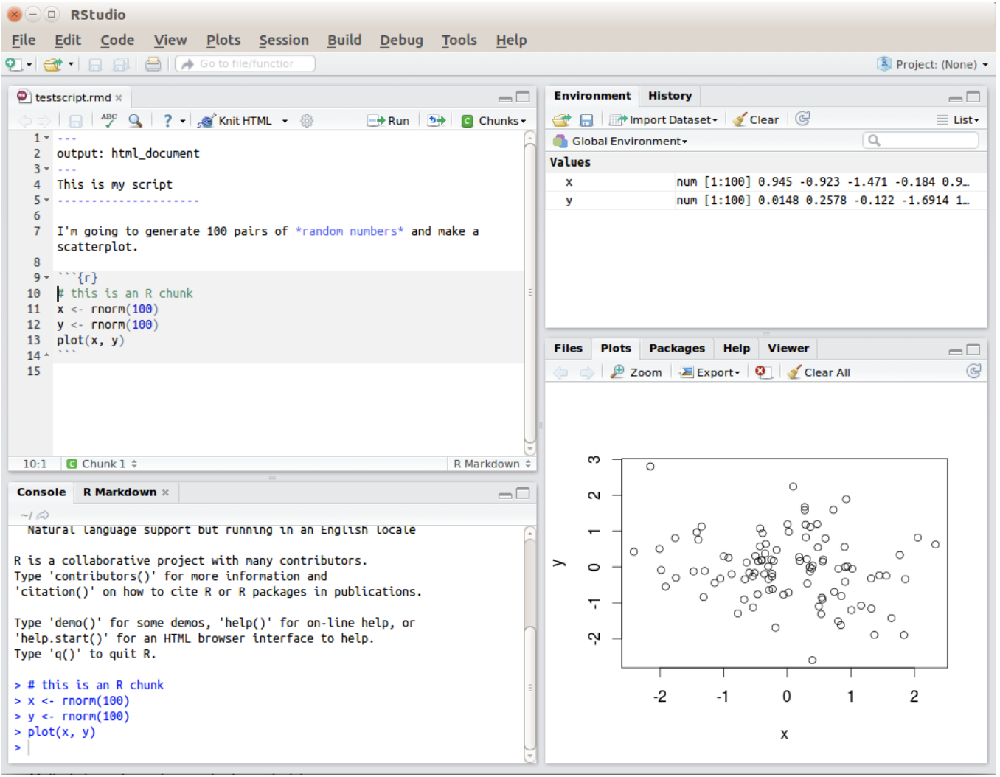

# Introduction

To get started, we will cover how to use *R* and *RStudio* as well as some basic programming concepts and terminology. We will discuss common pitfalls and, most importantly, where to get help. Those of you who have no programming experience should find this chapter particularly helpful, however, even if you've used *R* (or other languages) before there may be some (I hope) helpful stuff here.

Keep in mind: You are not expected to memorise all the information - just make sure you know what help is available and where you can look up the information you need!

# Getting a feel for R and RStudio
An important distinction to remember is between the R programming language itself, and the software you use to interact with R. You could choose to interact with R directly from the terminal, but that’s painful, so most people use an integrated development environment (IDE), which takes care of a lot of boring tasks for you. We’ll use the popular Rstudio IDE. To get started, make sure you have both R and RStudio installed on your computer. Both are free and open source, and for most people they should be straightforward to install.

* Installing R: Go to the [R website](https://www.r-project.org) and download the installer file. Once downloaded, open the installer file and follow the instructions.

* Installing RStudio: Go to the [RStudio website](https://www.rstudio.com), and follow the links to download RStudio. The version you want is the “RStudio Desktop”. Once the installer is downloaded, open it and follow the instructions.

R Studio has a console that you can try out code in (appearing as the bottom left window in Figure below), there is a script editor (top left), a window showing functions and objects you have created in the “environment” tab (top right window in the figure), and a window that shows plots, files packages, and help documentation (bottom right).

# Help
Getting good at programming really means getting good trying stuff out, searching for help online, and finding examples of code to copy. Learning to problem-solve effectively is a key skill that you need to develop over time.

Use the help documentation. If you're struggling to understand how a function works, remember the `?function` command.
If you get an error message, copy and paste it in to Google - it's very likely someone else has had the same problem.

In addition to these course materials there are a number of excellent resources for learning R:

* [R Cookbook](http://www.cookbook-r.com/)

* [StackOverflow](https://stackoverflow.com/)

* [R for Data Science](https://r4ds.had.co.nz/)

* Search or use the #rstats hashtag on Twitter

# Debugging tips

A large part of coding is trying to figure why *your code doesn't work* and this is true whether you are a novice or an expert. As you progress you should keep a record of mistakes you make and how you fixed them.

* Have you loaded the correct packages for the functions you are trying to use? One very common mistake is to write the code to load the package, e.g., library(tidyverse) but then forget to run it.

* Have you made a typo? Remember data is not the same as DATA and t.test is not the same as t_test.

* Is there a package conflict? Have you tried specifying the package and function with package::function?

* Is it definitely an error? Not all red text in R means an error - sometimes it is just giving you a message with information.
