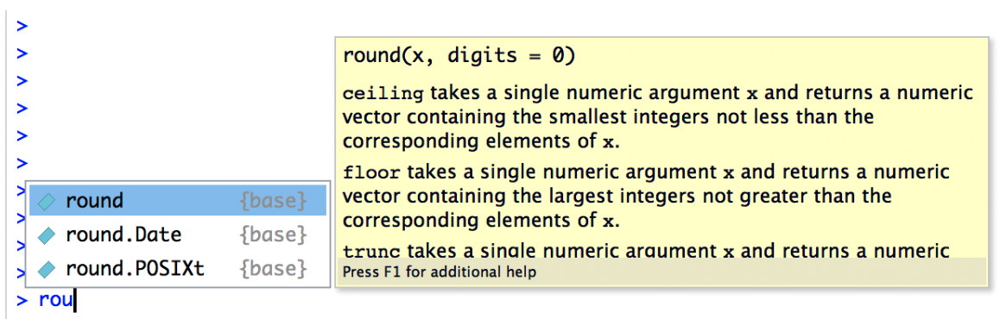

# Using functions

To calculate the square root of 255 using the `sqrt` function, the command I type is this:

```{r, echo = TRUE, eval = TRUE}
sqrt(225)
```

When we use a function to do something, we generally refer to this as calling the function, and the values that we type into the function (there can be more than one) are referred to as the arguments of that function.

Obviously, the `sqrt` function doesn’t really give us any new functionality, since we already knew how to do square root calculations by using the power operator `^`. However, there are lots of other functions in R: in fact, almost everything of interest that I’ll talk about in this book is an R function of some kind. For example, one function that comes in handy quite often is the absolute value function. Compared to the square root function, it’s extremely simple: it just converts negative numbers to positive numbers, and leaves positive numbers alone. Calculating absolute values in R is pretty easy, since R provides the abs function that you can use for this purpose. For instance:

```{r, echo = TRUE, eval = TRUE}
abs(-13)
```

# Combining functions

Before moving on, it’s worth noting that, in the same way that R allows us to put multiple operations together into a longer command (like `1 + 2 * 4` for instance), it also lets us put functions together and even combine functions with operators if we so desire. For example, the following is a perfectly legitimate command:

```{r, echo = TRUE, eval = TRUE}
sqrt(1 + abs(-8))
```

When R executes this command, starts out by calculating the value of `abs(-8)`, which produces an intermediate value of 8. Having done so, the command simplifies to `sqrt(1 + 8)`. To solve the square root it first needs to add `1 + 8` to get 9, at which point it evaluates `sqrt(9)`, and so it finally outputs a value of 3.

## Multiple arguments

There’s two more fairly important things that you need to understand about how functions work in R, and that’s the use of “named” arguments, and default values” for arguments. Not surprisingly, that’s not to say that this is the last we’ll hear about how functions work, but they are the last things we desperately need to discuss in order to get you started. To understand what these two concepts are all about, I’ll introduce another function. The `round` function can be used to round some value to the nearest whole number. For example, I could type this:

```{r, echo = TRUE, eval = TRUE}
round(3.1415)
```

Pretty straightforward, really. However, suppose I only wanted to round it to two decimal places: that is, I want to get 3.14 as the output. The `round` function supports this, by allowing you to input a second argument to the function that specifies the number of decimal places that you want to round the number to. In other words, I could do this:

```{r, echo = TRUE, eval = TRUE}
round(3.14165, 2)
```

What’s happening here is that I’ve specified two arguments: the first argument is the number that needs to be rounded (i.e., 3.1415), the second argument is the number of decimal places that it should be rounded to (i.e., 2), and the two arguments are separated by a comma.

## Argument names

In this simple example, it’s not too hard to remember which argument comes first and which one comes second, but as you might imagine it starts to get very difficult once you start using complicated functions that have lots of arguments. Fortunately, most R functions use argument names to make your life a little easier. For the `round` function, for example the number that needs to be rounded is specified using the x argument, and the number of decimal points that you want it rounded to is specified using the `digits` argument. Because we have these names available to us, we can specify the arguments to the function by name. We do so like this:

```{r, echo = TRUE, eval = TRUE}
round(x = 3.1415, digits = 2)
```

Notice that this is kind of similar in spirit to variable assignment, except that I used `=` here, rather than `<-`. In both cases we’re specifying specific values to be associated with a label. However, there are some differences between what I was doing earlier on when creating variables, and what I’m doing here when specifying arguments, and so as a consequence it’s important that you use `=` in this context.

As you can see, specifying the arguments by name involves a lot more typing, but it’s also a lot easier to read. Because of this, the commands in this book will usually specify arguments by name, since that makes it clearer to you what I’m doing. However, one important thing to note is that when specifying the arguments using their names, it doesn’t matter what order you type them in. But if you don’t use the argument names, then you have to input the arguments in the correct order. In other words, these three commands all produce the same output…

```{r, echo = TRUE, eval = TRUE}
round(3.14165, 2)
round(x = 3.1415, digits = 2)
round(digits = 2, x = 3.1415)
```

but this one does not…

```{r, echo = TRUE, eval = TRUE}
round(2, 3.14165)
```

# Default values

Okay, so that’s the first thing I said you’d need to know: argument names. The second thing you need to know about is default values. Notice that the first time I called the `round` function I didn’t actually specify the `digits` argument at all, and yet R somehow knew that this meant it should round to the nearest whole number. How did that happen? The answer is that the `digits` argument has a default value of 0, meaning that if you decide not to specify a value for digits then R will act as if you had typed `digits = 0`. This is quite handy: most of the time when you want to round a number you want to round it to the nearest whole number, and it would be pretty annoying to have to specify the `digits` argument every single time. On the other hand, sometimes you actually do want to round to something other than the nearest whole number, and it would be even more annoying if R didn’t allow this! Thus, by having `digits = 0` as the default value, we get the best of both worlds.

# Tab autocomplete

The first thing I want to call your attention to is the autocomplete ability in Rstudio. Let’s stick to our example above and assume that what you want to do is to round a number. This time around, start typing the name of the function that you want, and then hit the “tab” key. Rstudio will then display a little window like the one shown here:



In this figure, I’ve typed the letters `rou` at the command line, and then hit tab. The window has two panels. On the left, there’s a list of variables and functions that start with the letters that I’ve typed shown in black text, and some grey text that tells you where that variable/function is stored. Ignore the grey text for now: it won’t make much sense to you until we’ve talked about `packages`. There’s a few options there, and the one we want is round, but if you’re typing this yourself you’ll notice that when you hit the tab key the window pops up with the top entry highlighted. You can use the up and down arrow keys to select the one that you want. Or, if none of the options look right to you, you can hit the escape key (“esc”) or the left arrow key to make the window go away.

In our case, the thing we want is the `round` option, and the panel on the right tells you a bit about how the function works. This display is really handy. The very first thing it says is `round(x, digits = 0)` : what this is telling you is that the `round` function has two arguments. The first argument is called x, and it doesn’t have a default value. The second argument is `digits`, and it has a default value of `0`. In a lot of situations, that’s all the information you need. But Rstudio goes a bit further, and provides some additional information about the function underneath. Sometimes that additional information is very helpful, sometimes it’s not: Rstudio pulls that text from the R help documentation, and my experience is that the helpfulness of that documentation varies wildly. Anyway, if you’ve decided that `round` is the function that you want to use, you can hit the enter key and Rstudio will finish typing the rest of the function name for you.

# The history pane

One thing R does is keep track of your “command history”. That is, it remembers all the commands that you’ve previously typed. You can access this history in a few different ways. The simplest way is to use the up and down arrow keys. If you hit the up key, the R console will show you the most recent command that you’ve typed. Hit it again, and it will show you the command before that. If you want the text on the screen to go away, hit escape. Using the up and down keys can be really handy if you’ve typed a long command that had one typo in it. Rather than having to type it all again from scratch, you can use the up key to bring up the command and fix it.

The second way to get access to your command history is to look at the history panel in Rstudio. On the upper right hand side of the Rstudio window you’ll see a tab labelled “History”. Click on that, and you’ll see a list of all your recent commands displayed in that panel: it should look something like this:

If you double click on one of the commands, it will be copied to the R console. You can achieve the same result by selecting the command you want with the mouse and then clicking the “To Console” button.

