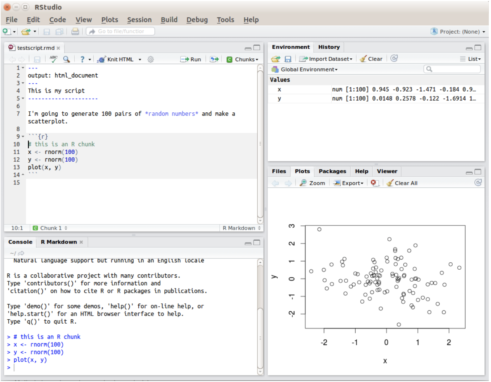

# Introduction

To get started, we will cover how to use *R* and *RStudio* as well as some basic programming concepts and terminology. We will discuss common pitfalls and, most importantly, where to get help. Those of you who have no programming experience should find this chapter particularly helpful, however, even if you've used *R* (or other languages) before there may be some (I hope) helpful stuff here.

Keep in mind: You are not expected to memorise all the information - just make sure you know what help is available and where you can look up the information you need!

# Getting a feel for R and RStudio
An important distinction to remember is between the R programming language itself, and the software you use to interact with R. You could choose to interact with R directly from the terminal, but that’s painful, so most people use an integrated development environment (IDE), which takes care of a lot of boring tasks for you. For this class, we’ll use the popular Rstudio IDE. To get started, make sure you have both R and RStudio installed on your computer. Both are free and open source, and for most people they should be straightforward to install.

* Installing R: Go to the [R website](https://www.r-project.org) and download the installer file. Once downloaded, open the installer file and follow the instructions.

* Installing RStudio: Go to the [RStudio website](https://www.rstudio.com), and follow the links to download RStudio. The version you want is the “RStudio Desktop”. Once the installer is downloaded, open it and follow the instructions.

R Studio has a console that you can try out code in (appearing as the bottom left window in Figure below), there is a script editor (top left), a window showing functions and objects you have created in the “environment” tab (top right window in the figure), and a window that shows plots, files packages, and help documentation (bottom right).



# One big calculator
## Console vs. scripts

When you first open up R Studio you won't see a script like above, there will just be a single pane on the left, which is the console. You can write code in the console to test it out, but it won't save anywhere. For this chapter, we'll use the console to show you some simple code examples but moving forward you'll save your code in a script file, and you'll see the extra pane appear.

One of the easiest things you can do with R is use it as a simple calculator, so it’s a good place to start. For instance, try typing `30`, and hitting enter. When you do this, you’ve entered a command, and R will execute that command. What you see on screen now will be this:

```{r, echo = TRUE, eval = TRUE}
10 + 20
```

Not a lot of surprises in this extract. But there’s a few things worth talking about, even with such a simple example. Firstly, it’s important that you understand how to read the extract. In this example, what I typed was the 10 + 20 part at the top, and the content below is what R produced.

Before we go on to talk about other types of calculations that we can do with R, there’s a few other things I want to point out. The first thing is that, while R is good software, it’s still software. It’s pretty stupid, and because it’s stupid it can’t handle typos. It takes it on faith that you meant to type exactly what you did type. For example, suppose that you forgot to hit the shift key when trying to type +, and as a result your command ended up being `10 = 20` rather than `10 + 20`. Here’s what happens:

```{r, echo = TRUE, eval = TRUE, error = TRUE}
10 = 20
```

What’s happened here is that R has attempted to interpret `10 = 20` as a command, and spits out an error message because the command doesn’t make any sense to it. When a human looks at this, and then looks down at his or her keyboard and sees that `+` and `=` are on the same key, it’s pretty obvious that the command was a typo. But R doesn’t know this, so it gets upset. And, if you look at it from its perspective, this makes sense. All that R “knows” is that 10 is a legitimate number, 20 is a legitimate number, and `=` is a legitimate part of the language too. In other words, from its perspective this really does look like the user meant to type `10 = 20`, since all the individual parts of that statement are legitimate and it’s too stupid to realize that this is probably a typo. Therefore, R takes it on faith that this is exactly what you meant… it only “discovers” that the command is nonsense when it tries to follow your instructions, typo and all. And then it whinges, and spits out an error.

Even more subtle is the fact that some typos won’t produce errors at all, because they happen to correspond to “well-formed” R commands. For instance, suppose that not only did I forget to hit the shift key when trying to type `10 + 20`, I also managed to press the key next to one I meant do. The resulting typo would produce the command `10 - 20`. Clearly, R has no way of knowing that you meant to add 20 to 10, not subtract 20 from 10, so what happens this time is this:

```{r, echo = TRUE, eval = TRUE}
10 - 20
```

In this case, R produces the right answer, but to the the wrong question.

To some extent, I’m stating the obvious here, but it’s important. The people who wrote R are smart. You, the user, are smart. But R itself is dumb. And because it’s dumb, it has to be mindlessly obedient. It does exactly what you ask it to do. There is no equivalent to “autocorrect” in R, and for good reason. When doing advanced stuff – and even the simplest of statistics is pretty advanced in a lot of ways – it’s dangerous to let a mindless automaton like R try to overrule the human user. But because of this, it’s your responsibility to be careful. Always make sure you type exactly what you mean. When dealing with computers, it’s not enough to type “approximately” the right thing. In general, you absolutely must be precise in what you say to R … like all machines it is too stupid to be anything other than absurdly literal in its interpretation.

## Commands and spacing

Of course, now that I’ve been so uptight about the importance of always being precise, I should point out that there are some exceptions. Or, more accurately, there are some situations in which R does show a bit more flexibility than my previous description suggests. The first thing R is smart enough to do is ignore redundant spacing. What I mean by this is that, when I typed `10 + 20` before, I could equally have done this

```{r, echo = TRUE, eval = TRUE}
10        + 20
```

and get exactly the same answer. However, that doesn’t mean that you can insert spaces in any old place. For instance, when you open up R it suggests that you type `citation()` to get some information about how to cite R:

```{r, echo = TRUE, eval = TRUE}
citation()
```

Okay, that’s good to know. Let’s see what happens when I try changing the spacing. If I insert spaces in between the word and the parentheses, or inside the parentheses themselves, then all is well. But inserting spaces in the middle of the commands, not so much. Try these three just to see:

`citation ()`     # works!

`citation(    )`  # works!

`cita tion()`     # doesn't work

## R knows you’re not finished?

One more thing I should point out. If you hit enter in a situation where it’s “obvious” to R that you haven’t actually finished typing the command, R is just smart enough to keep waiting. For example, if you type `10 +` and then press enter, even R is smart enough to realize that you probably wanted to type in another number. So here’s what happens:

```{r, echo = TRUE, eval = TRUE, error = TRUE}
10 +
``` 

and there’s a blinking cursor next to the plus sign. What this means is that R is still waiting for you to finish. It “thinks” you’re still typing your command, so it hasn’t tried to execute it yet. In other words, this plus sign is actually another command prompt. It’s different from the usual one (i.e., the `>` symbol) to remind you that R is going to “add” whatever you type now to what you typed last time. For example, if I then go on to type 20 and hit enter, what I get is this:

```{r, echo = TRUE, eval = TRUE}
10 +
+ 20
```

And as far as R is concerned, this is exactly the same as if you had typed 10 + 20. Similarly, consider the citation() command that we talked about in the previous section. Suppose you hit enter after typing citation(. Once again, R is smart enough to realise that there must be more coming – since you need to add the ) character – so it waits. I can even hit enter several times and it will keep waiting:

```{r, echo = TRUE, eval = FALSE}
citation( 
+
+
+)
```

Sometimes when doing this, you’ll eventually get yourself in trouble (it happens to us all). Maybe you start typing a command, and then you realise you’ve screwed up. For example,

```{r, echo = TRUE, eval = FALSE}
citblation(
+
+
```

You’d probably prefer R not to try running this command, right? If you want to get out of this situation, just hit the escape key. R will return you to the normal command prompt (i.e. >) without attempting to execute the botched command.

That being said, it’s not often the case that R is smart enough to tell that there’s more coming. For instance, in the same way that I can’t add a space in the middle of a word, I can’t hit enter in the middle of a word either. If I hit enter after typing `citat` I get an error, because R thinks I’m interested in something called citat and can’t find it:

```{r, echo = TRUE, eval = FALSE}
citat
```

What about if I typed citation and hit enter, without the parentheses? In this case we get something very odd, something that we definitely don’t want, at least not at this stage. Here’s what happens:

```{r, echo = TRUE, eval = TRUE}
citation
```

where the BLAH BLAH BLAH goes on for rather a long time, and you don’t know enough R yet to understand what all this gibberish actually means. This incomprehensible output can be quite intimidating to novice users, and unfortunately it’s very easy to forget to type the parentheses; so almost certainly you’ll do this by accident. Do not panic when this happens. Simply ignore the gibberish.

## Operations

Okay, now that we’ve discussed some of the tedious details associated with typing R commands, let’s get back to learning how to use the most powerful piece of statistical software in the world as a $2 calculator. So far, all we know how to do is addition. Clearly, a calculator that only did addition would be a bit stupid, so I should tell you about how to perform other simple calculations using R. But first, some more terminology. Addition is an example of an “operation” that you can perform (specifically, an arithmetic operation), and the operator that performs it is `+`. To people with a programming or mathematics background, this terminology probably feels pretty natural, but to other people it might feel like I’m trying to make something very simple (addition) sound more complicated than it is (by calling it an arithmetic operation). To some extent, that’s true: if addition was the only operation that we were interested in, it’d be a bit silly to introduce all this extra terminology. However, as we go along, we’ll start using more and more different kinds of operations, so it’s probably a good idea to get the language straight now, while we’re still talking about very familiar concepts like addition!

### Arithmetic operations

So, now that we have the terminology, let’s learn how to perform some arithmetic operations. R has operators that correspond to the basic arithmetic we learned in primary school: addition is `+`, subtraction is `-`, multiplication is `*` and division is `/`. As you can see, R uses fairly standard symbols to denote each of the different operations you might want to perform: if I wanted to find out what 57 times 61 is (and who wouldn’t?), I can use R instead of a calculator, like so:

```{r, echo = TRUE, eval = TRUE}
57 * 61
```

So that’s handy.

There are three other arithmetic operations that I should probably mention: taking powers, doing integer division, and calculating a modulus. Of the three, the only one that is of any real importance for the purposes of this book is taking powers, so I’ll discuss that one here: the other two are discussed later.

Type in the complete multiplication?

```{r, echo = TRUE, eval = TRUE}
5*5*5*5
```

but that does seem a bit tedious. It would be very annoying indeed if you wanted to calculate $5^{15}$, since the command would end up being quite long. Therefore, to make our lives easier, we use the power operator instead. When we do that, our command to calculate $5^{4}$ goes like this:

```{r, echo = TRUE, eval = TRUE}
5^4
```

Much easier.

### Order of operations

Okay. At this point, you know how to take one of the most powerful pieces of statistical software in the world, and use it as a calculator. And as a bonus, you’ve learned a few very basic programming concepts. That’s not nothing (you could argue that you’ve just saved yourself) but on the other hand, it’s not very much either. In order to use R more effectively, we need to introduce more programming concepts.

In most situations where you would want to use a calculator, you might want to do multiple calculations. R lets you do this, just by typing in longer commands. In fact, we’ve already seen an example of this earlier, when I typed in `5 * 5 * 5 * 5`. However, let’s try a slightly different example:

```{r, echo = TRUE, eval = TRUE}
1 + 2 * 4 
```

Clearly, this isn’t a problem for R either. However, it’s worth stopping for a second, and thinking about what R just did. Clearly, since it gave us an answer of 9 it must have multiplied 2 * 4 (to get an interim answer of 8) and then added 1 to that. But, suppose it had decided to just go from left to right: if R had decided instead to add 1+2 (to get an interim answer of 3) and then multiplied by 4, it would have come up with an answer of 12

To answer this, you need to know the order of operations that R uses. If you remember school maths classes, it’s actually the same order that you got taught when you were at school. That is, first calculate things inside Brackets, then calculate Exponents, then Division and Multiplication, then Addition and Subtraction. So, to continue the example above, if we want to force R to calculate the 1 + 2 part before the multiplication, all we would have to do is enclose it in brackets:

```{r, echo = TRUE, eval = TRUE}
(1 + 2) * 4
```

This is a fairly useful thing to be able to do. The only other thing I should point out about order of operations is what to expect when you have two operations that have the same priority: that is, how does R resolve ties? For instance, multiplication and division are actually the same priority, but what should we expect when we give R a problem like `4 / 2 * 3` to solve? If it evaluates the multiplication first and then the division, it would calculate a value of two-thirds. But if it evaluates the division first it calculates a value of six. The answer, in this case, is that R goes from left to right, so in this case the division step would come first:

```{r, echo = TRUE, eval = TRUE}
4 / 2 * 3
```

All of the above being said, it’s helpful to remember that brackets always come first. So, if you’re ever unsure about what order R will do things in, an easy solution is to enclose the thing you want it to do first in brackets. There’s nothing stopping you from typing `(4 / 2) * 3`. By enclosing the division in brackets we make it clear which thing is supposed to happen first. In this instance you wouldn’t have needed to, since R would have done the division first anyway, but when you’re first starting out it’s better to make sure R does what you want!

## Functions

The symbols `+`, `-`, `*` and so on are examples of operators. As we’ve seen, you can do quite a lot of calculations just by using these operators. However, in order to do more advanced calculations (and later on, to do actual statistics), you’re going to need to start using functions. I’ll talk in more detail about functions and how they work later, but for now let’s just dive in and use a few. To get started, suppose I wanted to take the square root of 225. 
There’s two ways I could do this using R. Firstly, since the square root of 255 is the same thing as raising 225 to the power of 0.5, I could use the power operator ^, just like we did earlier:

```{r, echo = TRUE, eval = TRUE}
225 ^ 0.5
```

However, there’s a second way to do this by using square root function `sqrt`. What´s a function, you ask? Well, there actually is a new page for that...

