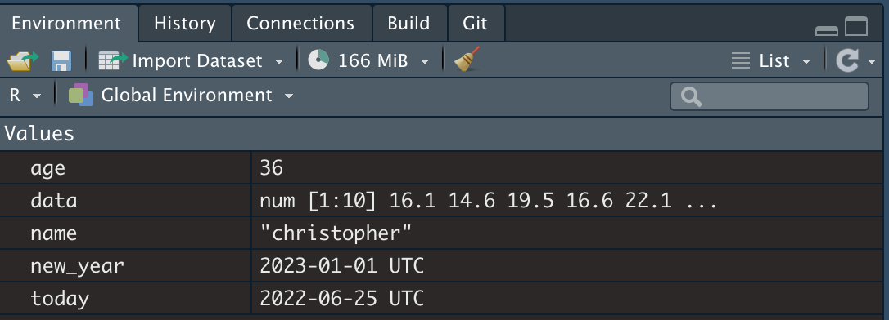
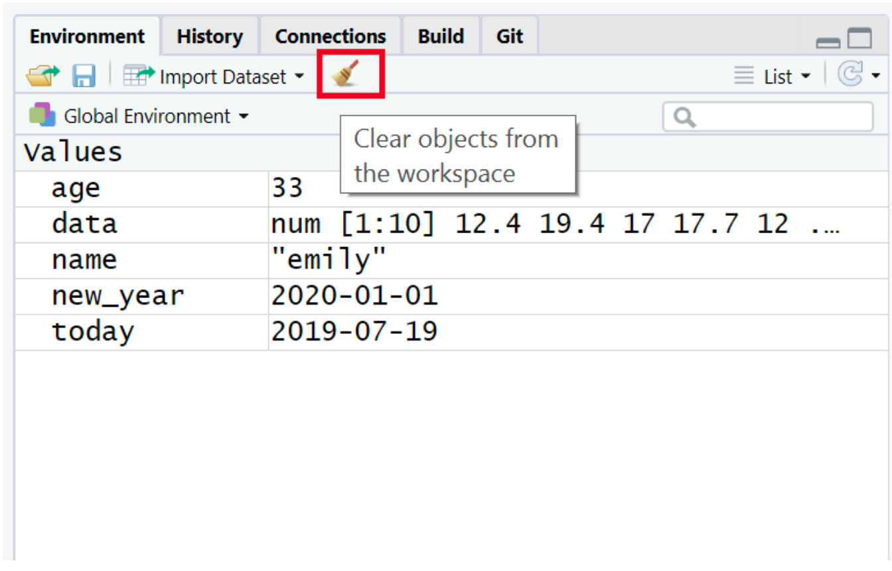
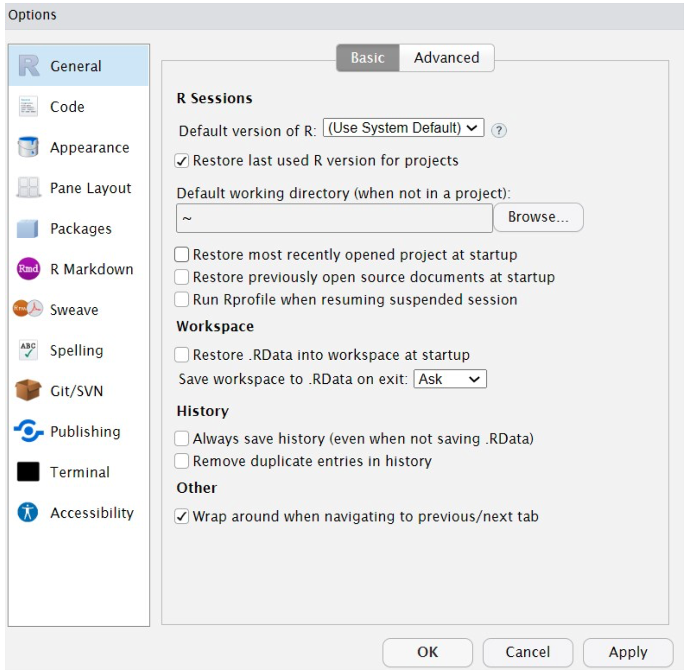
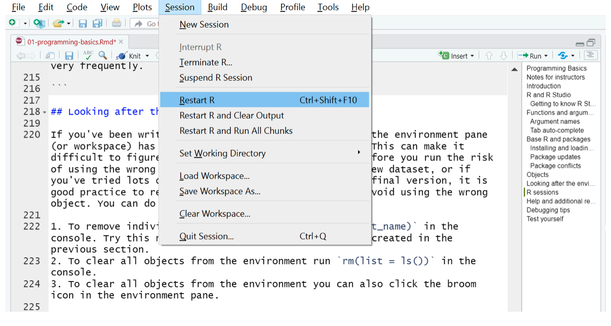
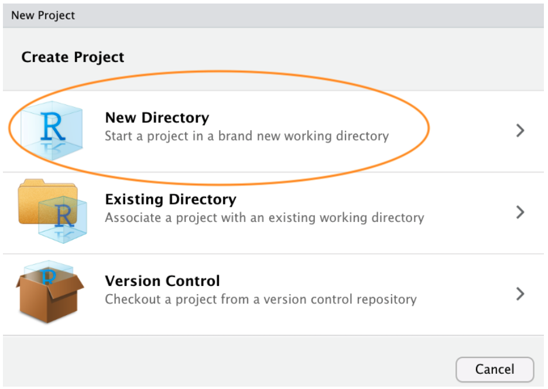
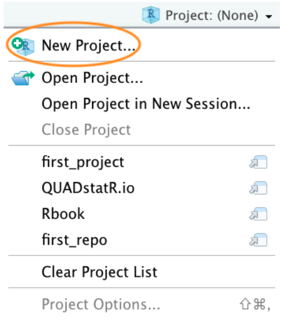
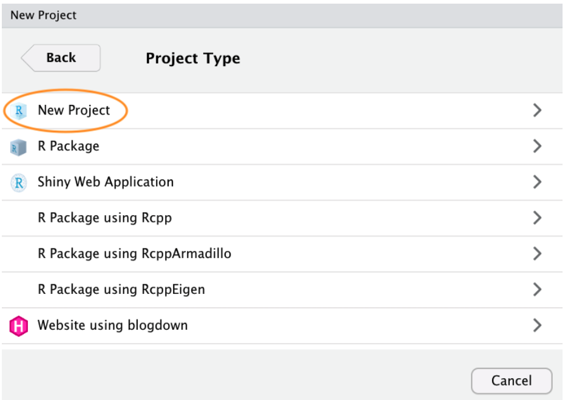
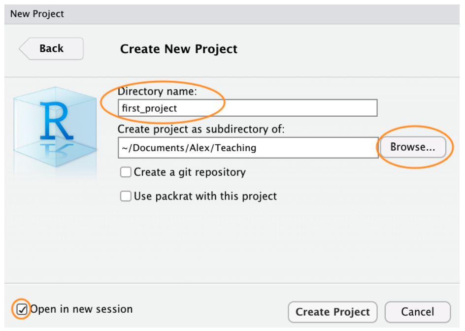
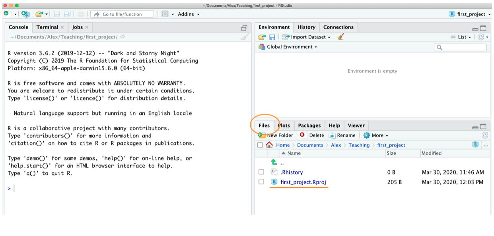
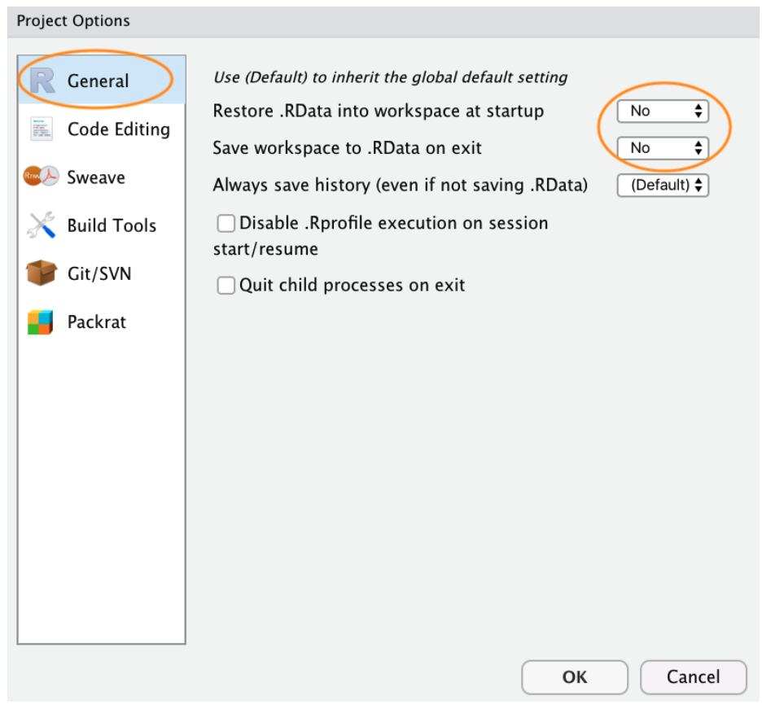

# Base R and packages

When you install R you will have access to a range of functions including options for data wrangling and statistical analysis. The functions that are included in the default installation are typically referred to as Base R and there is a useful cheat sheet that shows many Base R functions here.

However, the power of R is that it is extendable and open source - put simply, if a function doesn't exist or doesn't work very well, anyone can create a new package that contains data and code to allow you to perform new tasks. You may find it useful to think of Base R as the default apps that come on your phone and packages as additional apps that you need to download separately.

## Installing the tidyverse (or any other package)

In order to use a package, you must first install it. The following code installs the package tidyverse, a package we will use very frequently in this course.

If you are working on your own computer, use the below code to install the tidyverse. You do not need to do this if you are working on the server or if you are using the computers in the Boyd Orr building.

```{r, echo = TRUE, eval = FALSE}
install.packages("tidyverse")
```

You only need to install a package once, however, each time you start R you need to load the packages you want to use, in a similar way that you need to install an app on your phone once, but you need to open it every time you want to use it.

If you get an error message that says something like `WARNING: Rtools is required to build R packages` you may need to download and install an extra bit of software called Rtools.

To load packages we use the function `library()`. Typically you would start any analysis script by loading all of the packages you need, but we will come back to that in the next chapter.

## Loading the tidyverse (or any other package)

Run the below code to load the tidyverse. You can do this regardless of whether you are using your own computer or the server.

```{r, echo = TRUE, eval = FALSE}
library(tidyverse)
```

You will get what looks like an error message - it's not. It's just R telling you what it's done.

Now that we've loaded the tidyverse package we can use any of the functions it contains but remember, you need to run the `library()` function every time you start R.

## Package updates

In addition to updates to R and R Studio, the creators of packages also sometimes update their code. This can be to add functions to a package, or it can be to fix errors. One thing to avoid is unintentionally updating an installed package. When you run `install.packages()` it will always install the latest version of the package and it will overwrite any older versions you may have installed. Sometimes this isn't a problem, however, sometimes you will find that the update means your code no longer works as the package has changed substantially. It is possible to revert back to an older version of a package but try to avoid this anyway.

To avoid accidentally overwriting a package with a later version, you should never include `install.packages()` in your analysis scripts in case you, or someone else runs the code by mistake. Remember, the server will already have all of the packages you need for this course so you only need to install packages if you are using your own machine.

## Package conflicts

There are thousands of different R packages with even more functions. Unfortunately, sometimes different packages have the same function names. For example, the packages dplyr and MASS both have a function named `select()`. If you load both of these packages, R will produce a warning telling you that there is a conflict.

```{r, echo = TRUE, eval = TRUE, warning = TRUE}
library(dplyr)
library(MASS)
```

In this case, R is telling you that the function `select()` in the dplyr package is being hidden (or 'masked') by another function with the same name. If you were to try and use `select()`, R would use the function from the package that was loaded most recently - in this case it would use the function from MASS.

If you want to specify which package you want to use for a particular function you can use code in the format `package::function`, for example:

```{r, echo = TRUE, eval = FALSE}
dplyr::select()
MASS::select()
```

# Objects

A large part of your coding will involve creating and manipulating objects. Objects contain stuff. That stuff can be numbers, words, or the result of operations and analyses.You assign content to an object using `<-`.

## Create some objects

Copy and paste the following code into the console, change the code so that it uses your own name and age and run it. You should see that name, age, today, new_year, and data appear in the environment pane.

```{r, echo = TRUE, eval = TRUE}
name <- "christopher"
age <- 10 + 26 
today <-Sys.Date()
new_year <- as.Date("2023-01-01")
data <- rnorm(n = 10, mean = 15, sd = 3)
```



Note that in these examples, name,age, and new_year would always contain the values christopher, 36, and the date of New Year's Day 2023, however, today will draw the date from the operating system and data will be a randomly generated set of data so the values of these objects will not be static.

As a side note, if you ever have to teach programming and statistics, don't use your age as an example because every time you have to update your teaching materials you get a reminder of the fragility of existence and your advancing age. What about me? I will remain forever 36.

{width=50%}

Importantly, objects can be involved in calculations and can interact with each other. For example:

```{r, echo = TRUE, eval = TRUE}
age + 10
new_year - today
mean(data)
```

Finally, you can store the result of these operations in a new object:

```{r, echo = TRUE, eval = TRUE}
decade <- age + 10
```

You may also see objects referred to as *variables*. There is a difference between the two in programming terms, however, they are used synonymously very frequently.

# Looking after the environment

If you've been writing a lot of code you may find that the environment pane (or workspace) has become cluttered with many objects. This can make it difficult to figure out which object you need and therefore you run the risk of using the wrong data frame. If you're working on a new dataset, or if you've tried lots of different code before getting the final version, it is good practice to remember to clear the environment to avoid using the wrong object. You can do this in several ways.

To remove individual objects, you can type `rm(object_name)` in the console. Try this now to remove one of the objects you created in the previous section.  
To clear all objects from the environment run `rm(list = ls())` in the console.  
To clear all objects from the environment you can also click the broom icon in the environment pane.



# Global options

By default, when you open R Studio it will show you what you were last working on, including your code and any objects you have created. This might sound helpful, but actually it tends to cause more problems than it's worth because it means that you risk accidentally using an old version of an object. We recommend changing the settings so that each time you start R Studio, it opens a fresh copy (see next steps).



# R sessions

When you open up R and start writing code, loading packages, and creating objects, you're doing so in a new session. In addition to clearing the workspace, it can sometimes be useful to start a new session. This will happen automatically each time you start R on your computer. If you find that your code isn't working and you can't figure out why, it might be worth starting a new session. This will clear the environment and detach all loaded packages - think of it like restarting your phone.



# Projects in RStudio

As with most things in life, when it comes to dealing with data and data analysis things are so much simpler if you’re organised. Clear project organisation makes it easier for both you (especially the future you) and your collaborators to make sense of what you’ve done. There’s nothing more frustrating than coming back to a project months (sometimes years) later and have to spend days (or weeks) figuring out where everything is, what you did and why you did it. A well documented project that has a consistent and logical structure increases the likelihood that you can pick up where you left off with minimal fuss no matter how much time has passed. In addition, it’s much easier to write code to automate tasks when files are well organised and are sensibly named. 
This is even more relevant nowadays as it’s never been easier to collect vast amounts of data which can be saved across many separate data files. Lastly, having a well organised project reduces the risk of introducing bugs or errors into your workflow and if they do occur (which inevitably they will at some point), it makes it easier to track down these errors and deal with them efficiently.

Thankfully, there are some nice features in R and RStudio that make it quite easy to manage a project. There are also a few simple steps you can take right at the start of any project to help keep things shipshape.

A great way of keeping things organised is to use RStudio Projects. An RStudio Project keeps all of your R scripts, R markdown documents, R functions and data together in one place. The nice thing about RStudio Projects is that each project has its own directory, workspace, history and source documents so different analyses that you are working on are kept completely separate from each other. This means that you can have multiple instances of RStudio open at the same time (if that’s your thing) or you can switch very easily between projects without fear of them interfering with each other.

To create a project, open RStudio and select `File -> New Project...` from the menu. 

{width=80%}

You can also create a new project by clicking on the ‘Project’ button in the top right of RStudio and selecting ‘New Project…’

{width=70%}

In the next window select ‘New Project’.



Now enter the name of the directory you want to create in the `Directory name:` field. If you want to change the location of the directory on your computer click the `Browse…` button and navigate to where you would like to create the directory. Always tick the `Open in new session` box as well. Finally, hit the `Create Project` to create the new project.



Once your new project has been created you will now have a new folder on your computer that contains the RStudio project file `*.Rproj`. This `.Rproj` file contains various project options (but you shouldn’t really interact with it) and can also be used as a shortcut for opening the project directly from the file system (just double click on it). You can check this out in the ‘Files’ tab in RStudio (or in Finder if you’re on a Mac or File Explorer in Windows).



The last thing I suggest you do is select `Tools -> Project Options...` from the menu. Click on the `General` tab on the left hand side and then change the values for `Restore .RData into workspace at startup` and `Save workspace to .RData on exit` from ‘Default’ to ‘No’. This ensures that every time you open your project you start with a clean R session. You don’t have to do this (many people don’t) but I prefer to start with a completely clean workspace whenever I open my projects to avoid any potential conflicts with things I have done in previous sessions. The downside to this is that you will need to rerun your R code every time you open you project.



Now that you have an RStudio project set up you can start creating R scripts (or R markdown documents) or whatever you need to complete your project. All of the R scripts will now be contained within the RStudio project and saved in the project folder. R scripts and RMarkdown files are covered on different page (First steps - Writing)

# Working directories

The working directory is the default location where R will look for files you want to load and where it will put any files you save. One of the great things about using RStudio Projects is that when you open a project it will automatically set your working directory to the appropriate location. You can check the file path of your working directory by looking at bar at the top of the Console pane.

You can also use the `getwd()` function in the Console which returns the file path of the current working directory.

If you weren’t using an RStudio Project then you would have to set your working directory using the `setwd()` function at the start of every R script.

However, the problem with `setwd()` is that it uses an absolute file path which is specific to the computer you are working on. If you want to send your script to someone else (or if you’re working on a different computer) this absolute file path is not going to work on your friend´s / colleague´s computer as their directory configuration will be different. This results in a project that is not self-contained and not easily portable. RStudio solves this problem by allowing you to use relative file paths which are relative to the Root project directory. The Root project directory is just the directory that contains the .Rproj file. If you want to share your analysis with someone else, all you need to do is copy the entire project directory and send to your to your collaborator. They would then just need to open the project file and any R scripts that contain references to relative file paths will just work.
