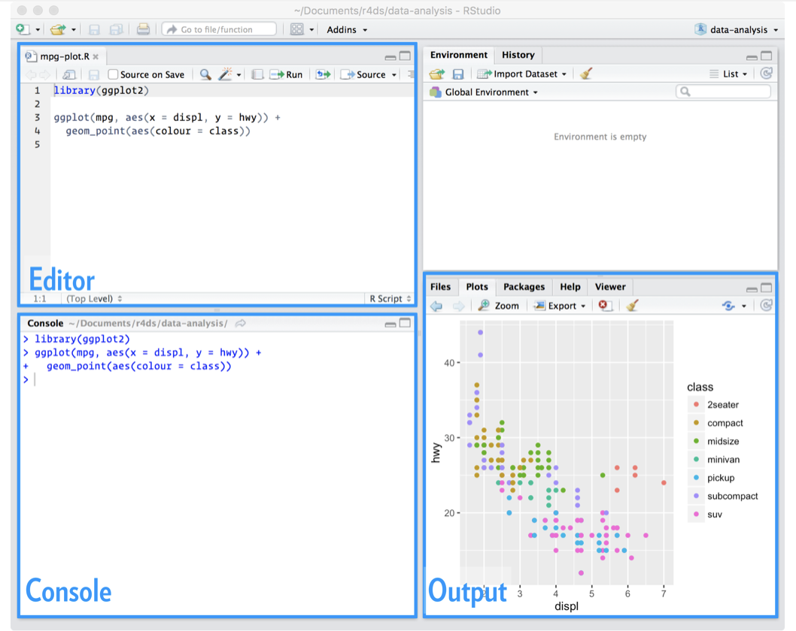
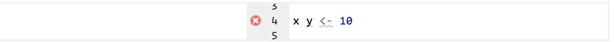
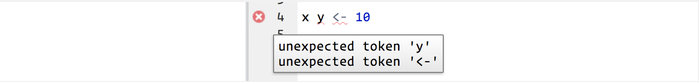
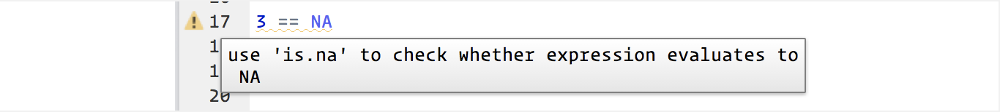
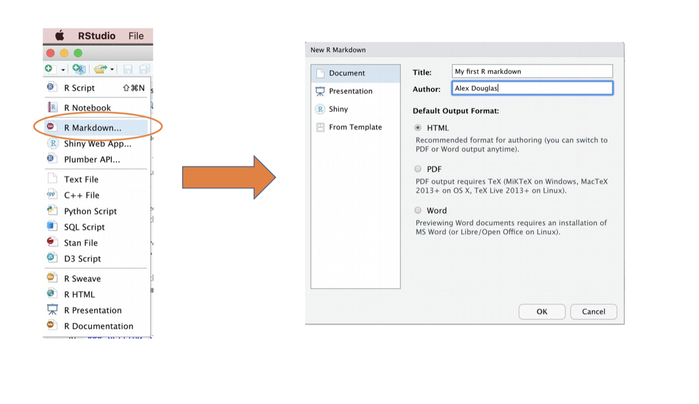
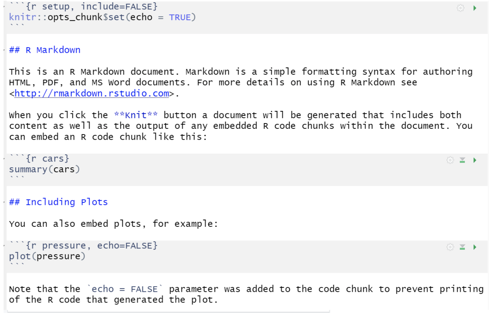
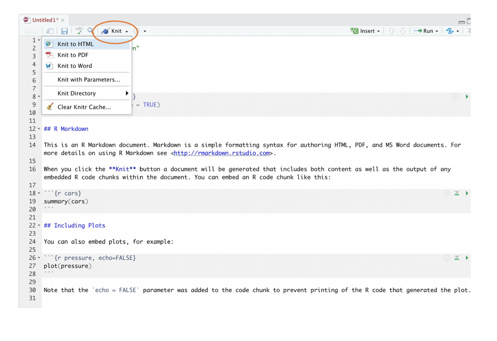
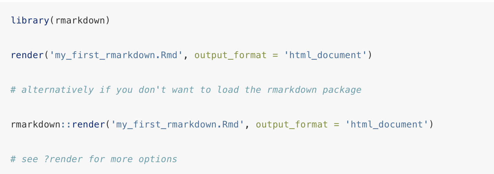

# R scripts

So far you’ve been using the console to run code. That’s a great place to start, but you’ll find it gets cramped pretty quickly as you create more complex ggplot2 graphics and dplyr pipes. To give yourself more room to work, it’s a great idea to use the script editor. Open it up either by clicking the File menu, and selecting New File, then R script, or using the keyboard shortcut `Cmd/Ctrl + Shift + N`. Now you’ll see four panes:



The script editor is a great place to put code you care about. Keep experimenting in the console, but once you have written code that works and does what you want, put it in the script editor. RStudio will automatically save the contents of the editor when you quit RStudio, and will automatically load it when you re-open. Nevertheless, it’s a good idea to save your scripts regularly and to back them up.

## Running code

The script editor is also a great place to build up complex ggplot2 plots or long sequences of dplyr manipulations. The key to using the script editor effectively is to memorise one of the most important keyboard shortcuts: Cmd/Ctrl + Enter. This executes the current R expression in the console. For example, take the code below. If your cursor is at █, pressing `Cmd/Ctrl + Enter` will run the complete command that generates `not_cancelled.` It will also move the cursor to the next statement (beginning with `not_cancelled %>%`). That makes it easy to run your complete script by repeatedly pressing `Cmd/Ctrl + Enter`.

```{r, echo = TRUE, eval = FALSE}
library(dplyr)
library(nycflights13)

not_cancelled <- flights %>% 
  filter(!is.na(dep_delay)█, !is.na(arr_delay))

not_cancelled %>% 
  group_by(year, month, day) %>% 
  summarise(mean = mean(dep_delay))Copy
```

Instead of running expression-by-expression, you can also execute the complete script in one step: `Cmd/Ctrl + Shift + S`. Doing this regularly is a great way to check that you’ve captured all the important parts of your code in the script.

I recommend that you always start your script with the packages that you need. That way, if you share your code with others, they can easily see what packages they need to install. Note, however, that you should never include `install.packages()` or `setwd()` in a script that you share. It’s very antisocial to change settings on someone else’s computer!

When working through future chapters, I highly recommend starting in the editor and practicing your keyboard shortcuts. Over time, sending code to the console in this way will become so natural that you won’t even think about it.

## RStudio diagnostics

The script editor will also highlight syntax errors with a red squiggly line and a cross in the sidebar:



Hover over the cross to see what the problem is:



RStudio will also let you know about potential problems:



# RMarkdown
RMarkdown is a simple and easy to use plain text language used to combine your R code, results from your data analysis (including plots and tables) and written commentary into a single nicely formatted and reproducible document (like a report, publication, thesis chapter or a web page like this one).

Technically, RMarkdown is a variant of another language (yet another language!) called Markdown and both are a type of ‘markup’ language. A markup language simply provides a way of creating an easy to read plain text file which can incorporate formatted text, images, headers and links to other documents. Actually, if it makes you feel any better all of you will have been exposed to a markup language before, as most of the internet content you digest every day is underpinned by a markup language called HTML (Hypertext Markup Language). 
Anyway, the main point is that RMarkdown is very easy to learn and when used with RStudio it’s ridiculously easy to integrate into your workflow to produce feature rich content (so why wouldn’t you?!).

## Why use RMarkdown?
Conducting your research in a robust and reproducible manner can have three main advantages:

* improve the overall quality

* make the content you produce easily shareable

* facilitate open science. 

In a nutshell, open science is about doing all we can to make our data, methods, results and inferences transparent and available to everyone. Some of the main tenets of open science are described here and include:

* Transparency in methodology, observation, collection of data and analytical methods.
* Public availability and re-usability of scientific data
* Public accessibility and transparency of scientific communication
* Using web-based tools to facilitate scientific collaboration

Soon, all of you will (hopefully) be using R to explore and analyze  data. Thus, you’ll already be on the road to making your analysis more reproducible, transparent and shareable. However, perhaps your current workflow looks something like this:

## Installing RMarkdown
To use RMarkdown you will first need to install the `rmarkdown` package in RStudio (or in the R console if you’re not using RStudio) and any package dependencies.

```{r, echo = TRUE, eval = FALSE}
install.packages("RMarkdown")
```

If you would like to create pdf documents (or MS Word documents) from your RMarkdown file you will also need to install a version of *LaTeX* on your computer. If you’ve not installed *LaTeX* before, I recommend that you install *TinyTeX*. Instructions on how to do this can be found [here](https://intro2r.com/install-rm.html#install-rm).

## Open and save a new RMarkdown document

To open a new RMarkdown document click `File` -> `New File` -> `R Markdown...`. You will be prompted to give it a title. Once you've opened that new document be sure to save it by clicking `File` -> `Save as`.



You will notice that when your new RMarkdown document is created it includes some example RMarkdown code. Normally you would just highlight and delete everything in the document except the information at the top between the --- delimiters (this is called the YAML header which we will discuss in a bit) and then start writing your own code. However, just for now we will use this document to practice converting RMarkdown to both html and pdf formats and check everything is working.



Once you’ve created your RMarkdown document it’s good practice to save this file somewhere convenient. You can do this by selecting `File` -> `Save` from RStudio menu (or use the keyboard shortcut `ctrl + s` on Windows or `cmd + s` on a Mac) and enter an appropriate file name. Notice the file extension of your new RMarkdown file is .Rmd.

Now, to convert your .Rmd file to a HTML document click on the little black triangle next to the `Knit` icon at the top of the source window and select knit to HTML.


RStudio will now ‘knit’ (or render) your .Rmd file into a HTML file. Notice that there is a new RMarkdown tab in your console window which provides you with information on the rendering process and will also display any errors if something goes wrong.

If everything went smoothly a new HTML file will have been created and saved in the same directory as your .Rmd file. To view this document simply double click on the file to open in a browser (like Chrome or Firefox) to display the rendered content. RStudio will also display a preview of the rendered file in a new window for you to check out (your window might look slightly different if you’re using a Windows computer).

Great, you’ve just rendered your first RMarkdown document. If you want to knit your .Rmd file to a pdf document then all you need to do is choose knit to PDF instead of knit to HTML when you click on the knit icon. This will create a file which you can double click to open. Give it a go!

You can also knit an .Rmd file using the command line in the console rather than by clicking on the knit icon. To do this, just use the `render()` function from the `rmarkdown` package as shown below. Again, you can change the output format using the `output_format =` argument as well as many other options.


