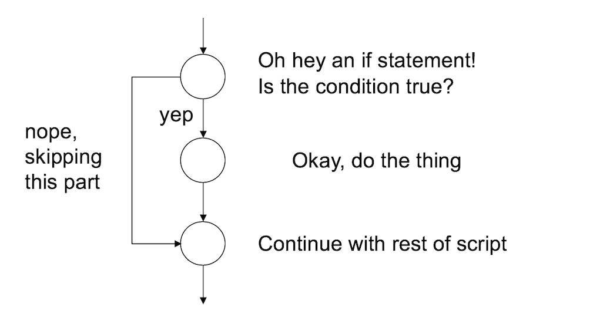
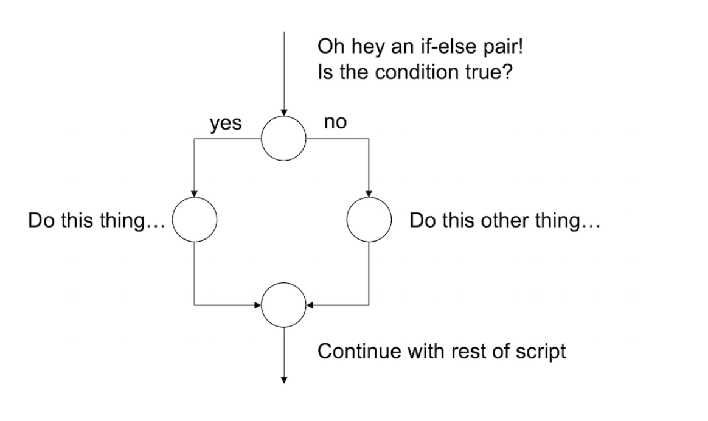

When I introduced the idea of working with scripts I said that R starts at the top of the file and runs straight through to the end of the file. While it is true that unless you insert commands to explicitly alter how the script runs, you actually have quite a lot of flexibility in this respect. Depending on how you write the script, you can have R repeat several commands, or skip over different commands, and so on. This topic is referred to as *flow control*.

# If/else

One kind of flow control that programming languages provide is the ability to evaluate conditional statements. Unlike *loops*, which can repeat over and over again, a *conditional statement* only executes once, but it can switch between different possible commands depending on a condition that is specified. The most prominent of example of a conditional statement is the `if` statement, and the accompanying `else` statement.

The basic format of an `if` statement in R is as follows:

```{r, echo = TRUE, eval = FALSE}
if ( CONDITION ) {
  STATEMENT1
  STATEMENT2
  ETC 
}
```

And the execution of the statement is pretty straightforward. If the condition is `TRUE`, then R will execute the statements contained in the curly braces. If the condition is `FALSE`, then it does not. So the way R processes an if statement is illustrated by this schematic representation:



If you want to, you can extend the `if` statement to include an `else` statement as well, leading to the following syntax:

```{r, echo = TRUE, eval = FALSE}
if ( CONDITION ) {
  STATEMENT1
  STATEMENT2
  ETC
} else {
  STATEMENT3
  STATEMENT4
  ETC
}
```

As you’d expect, the interpretation of this version is similar. If the condition is `TRUE`, then the contents of the first block of code (i.e., statement1, statement2, etc) are executed; but if it is `FALSE`, then the contents of the second block of code (i.e., statement3, statement4, etc) are executed instead. So the schematic illustration of an if-else construction looks like this:



In other words, when we use an `if-else` pair, we can define different behaviour for our script for both cases.

## Example 1:

To give you a feel for how you can use if and else, the example that I’ll show you is a script (feelings.R) that prints out a different message depending the day of the week. Here’s the script:

```{r, echo = TRUE, eval = FALSE}
if(today == "Monday") {
  print("I don’t like Mondays")
} else {
  print("I’m a happy little automaton")
}
```

So let’s set the value of today to Monday and source the script:

```{r, echo = TRUE, eval = TRUE}
today <- "Monday"
source("feelings.R")
```

That’s very sad. However, tomorrow should be better:

```{r, echo = TRUE, eval = TRUE}
today <- "Tuesday"
source("feelings.R")
```

## Example 2:

One useful feature of `if` and `else` is that you can chain several of them together to switch between several different possibilities. For example, the `more_feelings.R` script contains this code:

```{r, echo = TRUE, eval = FALSE}
if(today == "Monday") {
  print("I don’t like Mondays")
  
} else if(today == "Tuesday") {
  print("I’m a happy little automaton")
  
} else if(today == "Wednesday") {
  print("Wednesday is beige")
  
} else {
  print("eh, I have no feelings")
}
```

# Loops

... soon