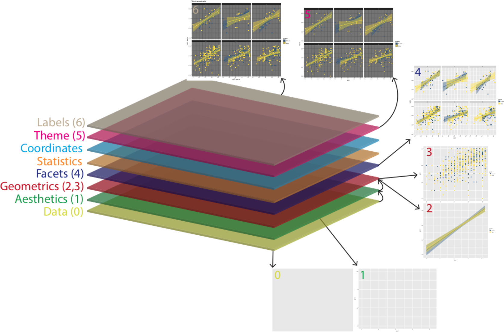

```{r, echo = FALSE, eval = TRUE}
library(readr)
library(dplyr)
detach("package:MASS", unload=TRUE)
```

# Introduction

Being able to visualise our variables, and relationships between our variables, is a very useful skill. Before we do any statistical analyses or present any summary statistics, we should visualize our data as it is:

* A quick and easy way to check our data make sense, and to identify any unusual trends.

* A way to honestly present the features of our data to anyone who reads our research.

`ggplot()` builds plots by combining layers (see below). If you're used to making plots in Excel this might seem a bit odd at first, however, it means that you can customize each layer and R is capable of making very complex and beautiful figures (this [website](https://www.data-to-viz.com/) gives you a good sense of what's possible).



# Preparing the data
As we will again use the data from the positive psychology replication study, we´ll quickly re-run import, inner_join() and selection of variables of interest.

```{r, echo = TRUE, eval = TRUE}
dat <- read_csv ("datasets/positive_psychology/ahi-cesd.csv") # import intervention data
pinfo <- read_csv("datasets/positive_psychology/participant-info.csv") # import participant data

all_dat <- inner_join(x = dat,                      # the first table you want to join
                      y = pinfo,                    # the second table you want to join
                      by = c("id", "intervention")) # columns the two tables have in common

summarydata <- select(.data = all_dat, 
                      ahiTotal, cesdTotal, sex, age, educ, income, occasion,elapsed.days)
```

Before we go any further we need to perform an additional step of data processing that we have glossed over up until this point. First, run the below code to look at the structure of the dataset:

```{r, echo = TRUE, eval = TRUE}
head(summarydata)

str(summarydata)
```

R assumes that all the variables are numeric (represented by `num`) and this is going to be a problem because whilst `sex`, `educ`, and `income` are represented by numerical codes, they aren't actually numbers, they're *categories*, or `factors`.

We need to tell R that these variables are `factors` and we can use `mutate()` to do this by overriding the original variable with the same data but classified as a `factor`.

```{r, echo = TRUE, eval = TRUE}
summarydata <- summarydata %>%
  mutate(sex = as.factor(sex),
         educ = as.factor(educ),
         income = as.factor(income))
```

You can read this code as "overwrite the data that is in the column sex with sex as a factor".

Remember this. It's a really important step and *if your graphs are looking weird this might be the reason*.

# Example 1: Bar plot

For our first example we will recreate the bar plot showing the number of male and female participants from loading data by showing you how the layers of code build up.

* The first line (or layer) sets up the base of the graph: the data to use and the aesthetics (what will go on the x and y axis, how the plot will be grouped).

* `aes()` can take both an `x` and `y` argument, however, with a bar plot you are just asking R to count the number of data points in each group so you don't need to specify this.

```{r, echo = TRUE, eval = TRUE}
ggplot(summarydata, aes(x = sex))
```

* The next layer adds a `geom` or a `shape`, in this case we use `geom_bar()` as we want to draw a bar plot.

```{r, echo = TRUE, eval = TRUE}
ggplot(summarydata, aes(x = sex)) +
  geom_bar()
```

* Adding `fill` to the first layer will separate the data into each *level of the grouping variable* and give it a different colour. In this case, there is a different colored bar for each level of sex.

```{r, echo = TRUE, eval = TRUE}
ggplot(summarydata, aes(x = sex, fill = sex)) +
  geom_bar()
```

* `fill()` has also produced a plot legend to the right of the graph. When you have multiple grouping variables you need this to know which groups each bit of the plot is referring to, but in this case it is redundant because it doesn't tell us anything that the axis labels don't already. We can get rid of it by adding `show.legend = FALSE` to the `geom_bar()` code.

```{r, echo = TRUE, eval = TRUE}
ggplot(summarydata, aes(x = sex, fill = sex)) +
  geom_bar(show.legend = FALSE)
```

We might want to tidy up our plot to make it look a bit nicer. First we can edit the axis labels to be more informative. The most common functions you will use are:

* `scale_x_continuous()` for adjusting the x-axis for a continuous variable

* `scale_y_continuous()` for adjusting the y-axis for a continuous variable

* `scale_x_discrete()` for adjusting the x-axis for a discrete/categorical variable

* `scale_y_discrete()` for adjusting the y-axis for a discrete/categorical variable

And in those functions the two most common arguments you will use are:

* `name` which controls the name of each axis

* `labels` which controls the names of the break points on the axis

There are lots more ways you can customise your axes but we'll stick with these for now. Copy, paste, and run the below code to change the axis labels and change the numeric sex codes into words.

```{r, echo = TRUE, eval = TRUE}
ggplot(summarydata, aes(x = sex, fill = sex)) +
  geom_bar(show.legend = FALSE) +
  scale_x_discrete(name = "Participant Sex", 
                   labels = c("Female", "Male")) +
  scale_y_continuous(name = "Number of participants")
```

Second, you might want to adjust the colors and the visual style of the plot. `ggplot2` comes with built in themes. Below, we'll use `theme_minimal()` but try typing `theme_` into a code chunk and try all the options that come up to see which one you like best.

```{r, echo = TRUE, eval = TRUE}
ggplot(summarydata, aes(x = sex, fill = sex)) +
  geom_bar(show.legend = FALSE) +
  scale_x_discrete(name = "Participant Sex", 
                   labels = c("Female", "Male")) +
  scale_y_continuous(name = "Number of participants") +
  theme_minimal()
```

There are various options to adjust the colors but a good way to be inclusive is to use a *color-blind friendly palette* that can also be read if printed in black-and-white. To do this, we can add on the function `scale_fill_viridis_d()`. This function has 5 colour options, A, B, C, D, and E. I prefer E but you can play around with them and choose the one you prefer.

```{r, echo = TRUE, eval = TRUE}
ggplot(summarydata, aes(x = sex, fill = sex)) +
  geom_bar(show.legend = FALSE) +
  scale_x_discrete(name = "Participant Sex", 
                   labels = c("Female", "Male")) +
  scale_y_continuous(name = "Number of participants") +
  theme_minimal() +
  scale_fill_viridis_d(option = "E")
``` 
  
Finally, you can also adjust the transparency of the bars by adding `alpha` to `geom_bar()`. Play around with the value and see what value you prefer.

```{r, echo = TRUE, eval = TRUE}
ggplot(summarydata, aes(x = sex, fill = sex)) +
  geom_bar(show.legend = FALSE, alpha = .8) +
  scale_x_discrete(name = "Participant Sex", 
                   labels = c("Female", "Male")) +
  scale_y_continuous(name = "Number of participants") +
  theme_minimal() +
  scale_fill_viridis_d(option = "E")
``` 
  
*Short note:* In R terms, `ggplot2` is a fairly old package. As a result, the use of pipes wasn't included when it was originally written. As you can see in the code above, the layers of the code are separated by `+` rather than `%>%`. In this case, `+` is doing essentially the same job as a pipe - be careful not to confuse them.

When checking out other peoples´ work, you may however find different approaches using pipes along the way (but NOT inside the plotting itself):

```{r, echo = TRUE, eval = TRUE}
summarydata %>%
  ggplot(aes(x = sex, fill = sex)) +
    geom_bar(show.legend = FALSE, alpha = .8) +
    scale_x_discrete(name = "Participant Sex", 
                     labels = c("Female", "Male")) +
    scale_y_continuous(name = "Number of participants") +
    theme_minimal() +
    scale_fill_viridis_d(option = "E")
``` 

## More complex example: Violin plots

Violin plots are a nice way to visualize distributions, and potentially include different moments. I´ll later show you some nice ways to actually tweak them by cutting them in half. But first things first.

* We add a `y` argument to the first layer because we wanted to represent two variables, not just a count.

* `geom_violin()` has an additional argument `trim`. Try setting this to `TRUE` to see what happens.

* `geom_boxplot()` has an additional argument `width`. Try adjusting the value of this and see what happens.

```{r, echo = TRUE, eval = TRUE}
ggplot(summarydata, aes(x = income, y = ahiTotal, fill = income)) +
  geom_violin(trim = FALSE, show.legend = FALSE, alpha = .4) +
  geom_boxplot(width = .2, show.legend = FALSE, alpha = .7)+
  scale_x_discrete(name = "Income",
                   labels = c("Below Average", "Average", "Above Average")) +
  scale_y_continuous(name = "Authentic Happiness Inventory Score")+
  theme_minimal() +
  scale_fill_viridis_d()
``` 

# Example 2: Scatterplot

We will now work with our data to generate a scatterplot of *two* variables.

First, we want to look at whether there seems to be a relationship between *happiness* and *depression* scores across all participants.

In order to visualize two continuous variables, we can use a *scatterplot*. Using the `ggplot` code you learned before, try and recreate the below plot.

A few hints:

* Use the summarydata data.

* Put ahiTotal on the x-axis and cesdTotal on the y-axis.

* Rather than using geom_bar(), geom_violin(), or geom_boxplot(), for a scatterplot you need to use geom_point().

* Rather than using scale_fill_viridis_d() to change the colour, add the argument colour = "red" to geom_point (except 

* replace "red" with whatever colour you'd prefer).

* Remember to edit the axis names.

```{r, echo = FALSE, eval = TRUE}
ggplot(summarydata, aes(x = ahiTotal , y = cesdTotal)) + 
  geom_point(colour = "red") +
  scale_x_continuous(name = "Happiness Score") +
  scale_y_continuous(name = "Depression Score")
```

## Adding a line for best fit 
Scatterplots are very useful but it can often help to add a line of best fit to help interpretation. Add the below layer to your scatterplot code:

* This code uses the function `geom_smooth()` to draw the line. There are several different methods but we want a straight, or linear, line so we specify `method = "lm"`.

* This line is really a regression line, which you'll learn more about later.

* By default the regression line will be extended, beyond the original y-axis limits, if you want to change this so that your plots looks like the below, add `limits = c(0,60)` to `scale_y_continuous()`

```{r, echo = TRUE, eval = FALSE}
geom_smooth(method = "lm")
```

```{r, echo = FALSE, eval = TRUE}
ggplot(summarydata, aes(x = ahiTotal , y = cesdTotal)) + 
  geom_point(colour = "red") +
  scale_x_continuous(name = "Happiness Score") +
  scale_y_continuous(name = "Depression Score") +
  geom_smooth(method = "lm")
```

It seems fairly obvious that there might be a negative relationship between happiness and depression, so instead we want to look at whether this relationship changes depending on different demographic variables.

## Grouped scatterplots

We can now use our factor variables (e.g., `sex`) to display the data in the scatterplots for each group.

* Rather than adding `colour` to `geom_point()` which sets the `colour` for all the data points, instead we add `colour = sex` to the *aesthetic mapping* on the first line. This tells `ggplot()` to produce different *colours for each level* (or group) in the variable sex.

* `scale_color_viridis_d()` works exactly like the other colour blind friendly scale functions you have used, so we can use name and labels to adjust the legend.

```{r, echo = TRUE, eval = TRUE}
ggplot(summarydata, aes(x = ahiTotal , y = cesdTotal, colour = sex)) + 
  geom_point() +
  scale_x_continuous(name = "Happiness Score") +
  scale_y_continuous(name = "Depression Score",
                     limits = c(0,60)) +
  theme_minimal() +
  geom_smooth(method = "lm") +
  scale_color_viridis_d(name = "Participant sex", 
                       labels = c("Male", "Female"),
                       option = "E")
```

It looks like the relationship between happiness and depression is about the same for male and female participants.

Create another scatterplot that shows the relationship between happiness and depression grouped by `educ`. Make sure you update the legend labels.

## Group by a new variable

So, let's be honest, there's not much going on with any of the demographic variables - the relationship between depression and anxiety is pretty much the same for all of the groups. A reasonable hypothesis might be that rather than being connected to any demographic variables, *the relationship between happiness and depression changes depending upon your general happiness level*.

* Using `mutate`, create a new variable named `happiness` in `summarydata` that evaluates whether a participant's happiness score is equal to or higher than the `median` `ahiTotal` score.

* This is not an easy task as it's not something I've explicitly shown you how to do but, do a bit of trial and error and you´ll do it.

* If you've done it right, summarydata should contain a column named happiness with the value `TRUE` if `ahiTotal` is above the overall median and `FALSE` if it is below.

```{r, echo = FALSE, eval = TRUE}
# Create new variable
summarydata <- mutate(summarydata, happiness = ahiTotal >= median(ahiTotal))

# Create plot
ggplot(summarydata, aes(x = ahiTotal , y = cesdTotal, colour = happiness)) + 
  geom_point() +
  scale_x_continuous(name = "Happiness Score") +
  scale_y_continuous(name = "Depression Score",
                     limits = c(0,60)) +
  theme_minimal() +
  geom_smooth(method = "lm") +
  scale_color_viridis_d(name = "Happiness", 
                       labels = c("Below median", "Above median"),
                       option = "E")
```

# More plotting options

`ggplot2` provides us with a host of different plotting options for different types of data. I´ll provide a brief overview of the most common ones under the `Types / overview`-tab.
