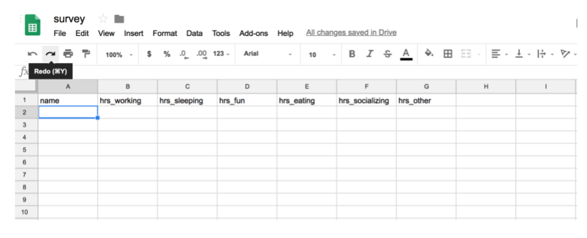
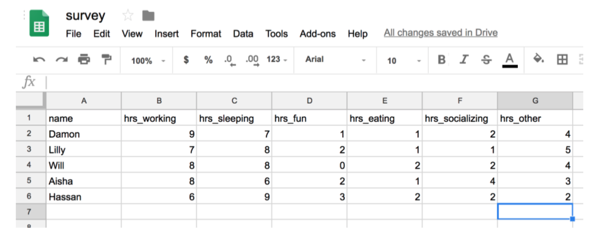
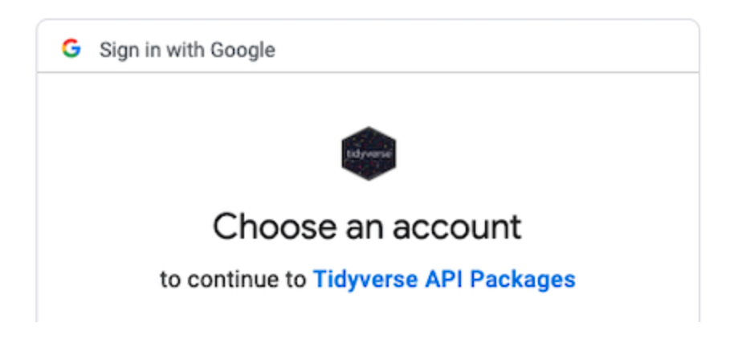
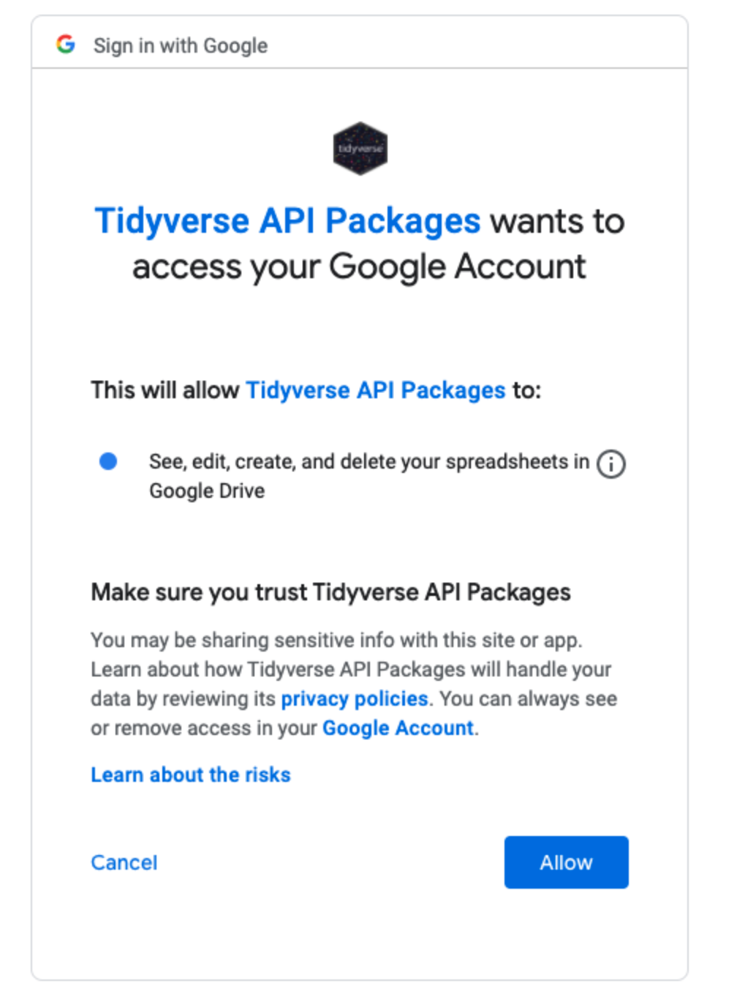
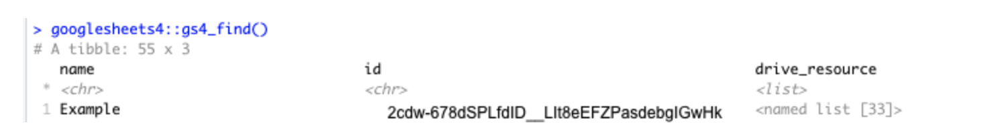
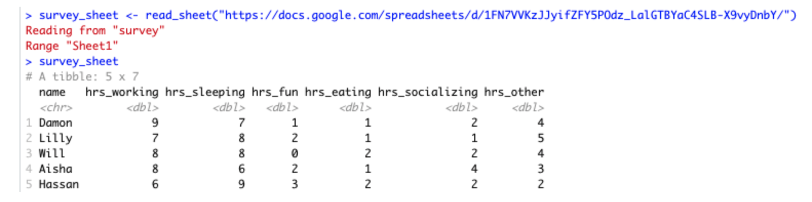
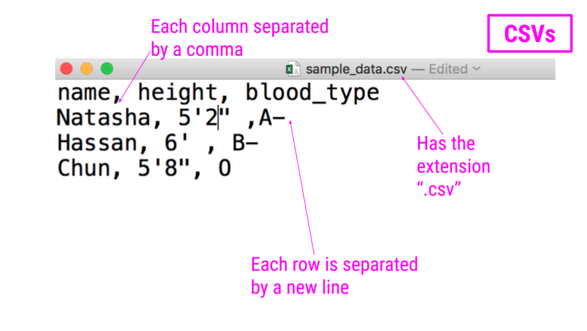

```{r, echo = FALSE, eval = TRUE, message = FALSE}
library(tidyverse)
library(readxl)
```

# Spreadsheets
  
Spreadsheets are an incredibly common format in which data are stored. If you’ve ever worked in Microsoft Excel or Google Sheets, you’ve worked with spreadsheets. By definition, spreadsheets require that information be stored in a grid utilizing rows and columns.

## Excel files

Microsoft Excel files, which typically have the file extension .xls or .xlsx, store information in a workbook. Each workbook is made up of one or more spreadsheet. Within these spreadsheets, information is stored in the format of values and formatting (colors, conditional formatting, font size, etc.). While this may be a format you’ve worked with before and are familiar, we note that Excel files can only be viewed in specific pieces of software (like Microsoft Excel), and thus are generally less flexible than many of the other formats we’ll discuss in this course. Additionally, Excel has certain defaults that make working with Excel data difficult outside of Excel. For example, Excel has a habit of aggressively changing data types. For example if you type 1/2, to mean 0.5 or one-half, Excel assumes that this is a date and converts this information to January 2nd. If you are unfamiliar with these defaults, your spreadsheet can sometimes store information other than what you or whoever entered the data into the Excel spreadsheet may have intended. Thus, it’s important to understand the quirks of how Excel handles data. Nevertheless, many people do save their data in Excel, so it’s important to know how to work with them in R.

### Reading Excel files into R

Reading spreadsheets from Excel into R is made possible thanks to the `readxl` package. This should be installed with the `tidyverse` package, but, rather surprisingly, you´ll have to load it separately:

```{r, echo = TRUE, eval = FALSE}
library(readxl)
```

The function `read_excel()` is particularly helpful whenever you want read an Excel file into your R Environment. The only required argument of this function is the path to the Excel file on your computer. In the following example, `read_excel()` would look for the file `filename.xlsx` in your current working directory (in our case, the one of your R project). If the file were located somewhere else on your computer, you would have to provide the path to that file.

```{r, echo = TRUE, eval = FALSE}
df_excel <- read_excel("filename.xlsx")
```

Within the `readxl` package there are a number of example datasets that we can use to demonstrate the packages functionality. To read the example dataset in, we’ll use the `readxl_example()` function.

```{r, echo = TRUE, eval = TRUE}
example <- readxl_example("datasets.xlsx") # read example dataset

df <- read_excel(example) # read into tibble from source
df
```

Note that the information stored in `df` is a tibble. That´s good, we like that.

Further, by default, `read_excel()` converts blank cells to missing data (NA). This behavior can be changed by specifying the `na argument` within this function. There are a number of additional helpful arguments within this function. They can all be seen using `?read_excel`, but we’ll highlight a few here:

* `sheet` - argument specifies the name of the sheet from the workbook you’d like to read in (string) or the integer of the sheet from the workbook.

* `col_names` - specifies whether the first row of the spreadsheet should be used as column names (default: `TRUE`). Additionally, if a character vector is passed, this will rename the columns explicitly at time of import.

* `skip` - specifies the number of rows to skip before reading information from the file into R. Often blank rows or information about the data are stored at the top of the spreadsheet that you want R to ignore.

For example, we are able to change the column names directly by passing a character string to the `col_names` argument:

```{r, echo = TRUE, eval = TRUE}
read_excel(example, col_names = LETTERS[1:5])
```

To take this a step further let’s discuss one of the lesser-known arguments of the `read_excel()` function: `.name_repair`. This argument allows for further fine-tuning and handling of column names.

The default for this argument is `.name_repair = "unique"`. This checks to make sure that each column of the imported file has a unique name. If TRUE, `readxl` leaves them as is, as you see in the example here:

```{r, echo = TRUE, eval = TRUE}
read_excel(
  readxl_example("deaths.xlsx"),
  range = "A5:F8",
  .name_repair = "unique" # read example file into R using .name_repair default
)
```

Another option for this argument is `.name_repair = "universal"`. This ensures that column names don’t contain any forbidden characters or reserved words. It’s often a good idea to use this option if you plan to use these data with other packages downstream. This ensures that all the column names will work, regardless of the R package being used.

```{r, echo = TRUE, eval = TRUE}
read_excel(
  readxl_example("deaths.xlsx"),
  range = "A5:F8",
  .name_repair = "universal" # require use of universal naming conventions
)
```

Note that when using `.name_repair = "universal"`, you’ll get a readout about which column names have been changed. Here you see that column names with a space in them have been changed to periods for word separation.

Aside from these options, functions can be passed to `.name_repair`. For example, if you want all of your column names to be lowercase, you would use the following:

```{r, echo = TRUE, eval = TRUE}
read_excel(
  readxl_example("deaths.xlsx"),
  range = "arts!A5:F8",
  .name_repair = tolower # pass function for column naming
)
```

Notice that the function is passed directly to the argument. It does not have quotes around it, as we want this to be interpreted as the `tolower()` function.

Here we’ve really only focused on a single function (`read_excel()`) from the `readxl` package. This is because some of the best packages do a single thing and do that single thing well. The `readxl` package has a single, slick function that covers most of what you’ll need when reading in files from Excel. That is not to say that the package doesn’t have other useful functions (it does!), but this function will cover your needs most of the time.

## Google Sheets

Similar to Microsoft Excel, Google Sheets is another place in which spreadsheet information is stored. Google Sheets also stores information in spreadsheets within workbooks. Like Excel, it allows for cell formatting and has defaults during data entry that could get you into trouble if you’re not familiar with the program.

Unlike Excel files, however, Google Sheets live on the Internet, rather than your computer. This makes sharing and updating Google Sheets among people working on the same project much quicker. This also makes the process for reading them into R slightly different. Accordingly, it requires the use of a different, but also very helpful package, `googlesheets4`!

As Google Sheets are stored on the Internet and not on your computer, the `googlesheets4` package does not require you to download the file to your computer before reading it into R. Instead, it reads the data into R directly from Google Sheets. Note that if the data hosted on Google Sheets changes, every time the file is read into R, the most updated version of the file will be utilized. This can be very helpful if you’re collecting data over time; however, it could lead to unexpected changes in results if you’re not aware that the data in the Google Sheet is changing.

To see exactly what we mean, let’s look at a specific example. Imagine you’ve sent out a survey to your friends asking about how they spend their day. Let’s say you’re mostly interested in knowing the hours spent on work, leisure, sleep, eating, socializing, and other activities. So in your Google Sheet you add these six items as columns and one column asking for your friends names. To collect this data, you then share the link with your friends, giving them the ability to edit the Google Sheet.



Your friends will then one-by-one complete the survey. And, because it’s a Google Sheet, everyone will be able to update the Google Sheet, regardless of whether or not someone else is also looking at the Sheet at the same time. As they do, you’ll be able to pull the data and import it to R for analysis at any point. You won’t have to wait for everyone to respond. You’ll be able to analyze the results in real-time by directly reading it into R from Google Sheets, avoiding the need to download it each time you do so.

In other words, every time you import the data from the Google Sheets link using the googlesheets4 package, the most updated data will be imported. Let’s say, after waiting for a week, your friends’ data look something like this:



You’d be able to analyze these updated data using R and the googlesheets4 package!

### The `googlesheets4` package

The `googlesheets4` package allows R users to take advantage of the Google Sheets Application Programming Interface (API). Very generally, APIs allow different applications to communicate with one another. In this case, Google has released an API that allows other software to communicate with Google Sheets and retrieve data and information directly from Google Sheets. The `googlesheets4` package enables R users to easily access the Google Sheets API and retrieve your Google Sheets data.

In addition to the ability of pulling data, you can also edit a Google Sheet or create new sheets.

The `googlesheets4` package is tidyverse-adjacent, so it requires its own installation. It also requires that you load it into R before it can be used.

```{r, echo = TRUE, eval = FALSE}
install.packages("googlesheets4")

library(googlesheets4)
```

Now, let’s get to importing your survey data into R. Every time you start a new session, you need to authenticate the use of the `googlesheets4` package with your Google account. This is a great feature as it ensures that you want to allow access to your Google Sheets and allows the Google Sheets API to make sure that you should have access to the files you’re going to try to access.

The command `gs4_auth()` will open a new page in your browser that asks you which Google account you’d like to have access to. Click on the appropriate Google user to provide `googlesheets4` access to the Google Sheets API.



After you click “ALLOW,” giving permission for the `googlesheets4` package to connect to your Google account, you will likely be shown a screen where you will be asked to copy an authentication code. Copy this authentication code and paste it into R.



Once authenticated, you can use the command `gs4_find()` to list all your worksheets on Google Sheets as a table. Note that this will ask for authorization of the `googledrive` package. We will discuss more about googledrive later (after I´ve finished writing that page...).



In order to ultimately access the information a specific Google Sheet, you can use the read_sheets() function by typing in the id listed for your Google Sheet of interest when using `gs4_find()`.

```{r, echo = TRUE, eval = FALSE}
read_sheet("2cdw-678dSPLfdID__LIt8eEFZPasdebgIGwHk") # note this is not a real fake id. surprise there.
```

You can also navigate to your own sheets or to other people’s sheets using a URL. We will now read one into R using the URL:

```{r, echo = TRUE, eval = FALSE}
survey_sheet <- read_sheet("https://docs.google.com/spreadsheets/d/1FN7VVKzJJyifZFY5POdz_LalGTBYaC4SLB-X9vyDnbY/")
```

Note that we assign the information stored in this Google Sheet to the object `survey_sheet` so that we can use it again shortly.



Note that by default the data on the first sheet will be read into R. If you wanted the data on a particular sheet you could specify with the `sheet` argument, like so:

```{r, echo = TRUE, eval = FALSE}
survey_sheet <- read_sheet("https://docs.google.com/spreadsheets/d/1FN7VVKzJJyifZFY5POdz_LalGTBYaC4SLB-X9vyDnbY/", sheet = 2)
```

If the sheet was named something in particular you would use this instead of the number 2.

There are other additional (optional) arguments to `read_sheet()`, some are similar to those in `read_csv()` and `read_excel()`, while others are more specific to reading in Google Sheets:

* skip = 1: will skip the first row of the Google Sheet

* col_names = FALSE`: specifies that the first row is not column names

* range = "A1:G5": specifies the range of cells that we like to import is A1 to G5

* n_max = 100: specifies the maximum number of rows that we want to import is 100

In summary, to read in data from a Google Sheet in `googlesheets4`, you must first know the id, the name or the URL of the Google Sheet and have access to it.

See [this website](https://googlesheets4.tidyverse.org/reference/index.html) for a list of additional functions in the `googlesheets4` package.

# CSVs
Like Excel Spreadsheets and Google Sheets, Comma-separated values (CSV) files allow us to store tabular data; however, it does this in a much simple format. CSVs are plain-text files, which means that all the important information in the file is represented by text (where text is numbers, letters, and symbols you can type on your keyboard). This means that there are no workbooks or metadata making it difficult to open these files. CSVs are flexible files and are thus the preferred storage method for tabular data for many data scientists.

For example, consider a dataset that includes information about the heights and blood types of three individuals. You could make a table that has three columns (names, heights, and blood types) and three rows (one for each person) in Google Docs or Microsoft Word. However, there is a better way of storing this data in plain text without needing to put them in table format. CSVs are a perfect way to store these data. In the CSV format, the values of each column for each person in the data are separated by commas and each row (each person in our case) is separated by a new line. This means your data would be stored in the following format:



Notice that CSV files have a .csv extension at the end. You can see this above at the top of the file. One of the advantages of CSV files is their simplicity. Because of this, they are one of the most common file formats used to store tabular data. Additionally, because they are plain text, they are compatible with many different types of software. CSVs can be read by most programs. Specifically, for our purposes, these files can be easily read into R (or Google Sheets, or Excel), where they can be better understood by the human eye.

As with any file type, CSVs do have their limitations. Specifically, CSV files are best used for data that have a consistent number of variables across observations. In our example, there are three variables for each observation: “name,” “height,” and “blood_type.” If, however, you had eye color and weight for the second observation, but not for the other rows, you’d have a different number of variables for the second observation than the other two. This type of data is not best suited for CSVs (although NA values could be used to make the data rectangular). Whenever you have information with the same number of variables across all observations, CSVs are a good bet!

## Reading CSVs into R

Now that you have a CSV file, let’s discuss how to get it into R! The best way to accomplish this is using the function `read_csv()` from the readr package. (Note, if you haven’t installed the `readr` package, you’ll have to do that first.) Inside the parentheses of the function, write the name of the file in quotes, including the file extension (.csv). Make sure you type the exact file name. Save the imported data in a data frame called `df_csv`. Your data will now be imported into R environment.

```{r, echo = TRUE, eval = FALSE}
library(readr)

df_csv <- read_csv("example.csv") ## read CSV into R
```

Above, you see the simplest way to import a CSV file. However, as with many functions, there are other arguments that you can set to specify how to import your specific CSV file, a few of which are listed below. However, as usual, to see all the arguments for this function, use `?read_csv` within R.

* `col_names = FALSE` to specify that the first row does NOT contain column names.

* `skip = 2` will skip the first 2 rows. You can set the number to any number you want. This is helpful if there is 
additional information in the first few rows of your data frame that are not actually part of the table.

* `n_max = 100` will only read in the first 100 rows. You can set the number to any number you want. This is helpful if you’re not sure how big a file is and just want to see part of it.

By default, `read_csv()` converts blank cells to missing data (`NA`).

We have introduced the function `read_csv` here and recommend that you use it, as it is the simplest and fastest way to read CSV files into R. However, we note that there *is* a function `read.csv()` which is available by default in R. You will likely see this function in others’ code, so we just want to make sure you’re aware of it.

# Other file types
R can read in data files in many different formats. The `haven` package is part of the `tidyverse`. It provides functions to read files created in a variety of commercial software packages. R can also talk directly to databases. If your dataset is a Stata `.dta` file, for instance, you can use the `read_dta()` function in much the same way as we used `read_csv()` above.

Beyond that, R has lots of other importing capabilities - I´ll cover some of those here soonish, too. You could, for example, import TSVs, different delimited files, scrape data from web or social media platforms.
